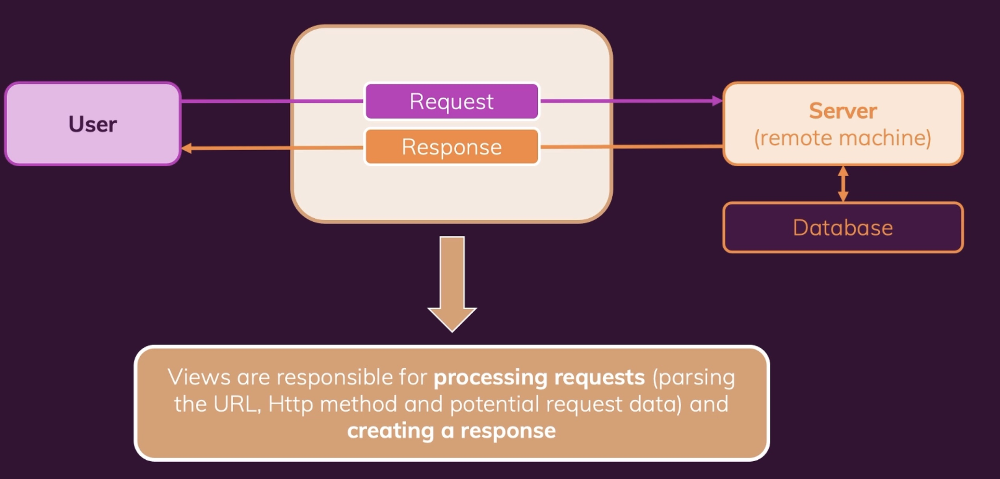

# django
tutorial for django<br>
https://pplearn.udemy.com/course/python-django-the-practical-guide/learn/lecture/26372712#overview<br>
https://academind.com/community/<br>
https://www.djangoproject.com/<br>

1. What is Flask and Django? 
- Flask and Django are both open-source Python-based web development frameworks designed to ease code complexity for developers. While Django is a full-stack framework, Flask is famous as a micro-framework that is light-weight but extensible.

# 1. Intro
1. what is Django
- Django is Python web develoment framework
    - built for python 3.x
        - built for the latest version of python
    - Batteries included
        - offers built-in solutions and features for basically all problems
        - customizable & extensible
    - Build production-ready websites
        - django can be used and is used for building real websites

2. what's inside the course?
    - Foundation
        - Setup & understanding django projects
        - URLS, routes & views
        - Templates & static files
        - Data, models & relationships
    - Beyond the basics
        - working with forms
        - class-based views
        - file uploads
        - sessions
    - Preparing for reaility
        - many small examples
        - a real project (building a blog)
        - frontend + admin area
        - in-depth deployment guide

<br><br><br><br><br><br>

# 2. Course setup
https://github.com/academind/django-practical-guide-course-code/tree/setup-zz-extra-files<br>

1. install python & django
```bash
# setup virtual environment
$ python3.10 -m venv .venv

# install django
# https://docs.djangoproject.com/en/4.2/topics/install/#installing-official-release
$ pip install Django

# verify django installed 
$ django-admin
```


2. creating a django project
```bash
# create a django projects
$ django-admin startproject mypage
```

3. launch local server and test website
```bash
$ cd mypage
$ python3.10 manage.py runserver
$ python3 manage.py runserver
>>http://127.0.0.1:8000/
or
>>localhost:8000
```

4. create a Django Apps
```bash
# create a new sub file
$ python3 manage.py startapp challenges


```

<br><br><br><br><br><br>

# 3. URLs & Views
1. create a new project
```bash
# create a new project
$ django-admin startproject monthly_challenges
$ cd monthly_challenges

# create a new app
$ python3 manage.py startapp challenges
```

2. URLs(Rountes) & Views
    - URLs
        - 
    - Views
        - 
        

3. Creating a firt view
- 

```bash
# (1) go to view.py file

# (2) add Response 

# (3) add url in challenges/urls.py

# (4) add url in monthly_challenges/urls.py

```
- Request/ Response Flow
    - 


4. adding more view & URLs
    - every view is a standalone function
